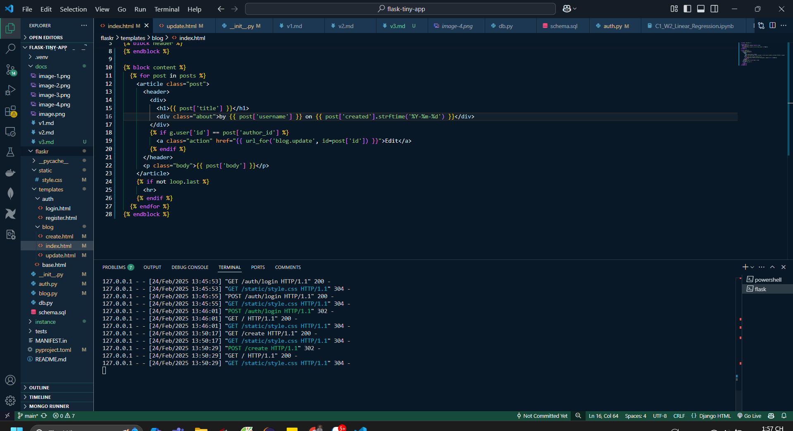
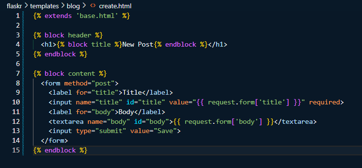

# Phiên bản 3.0 (v3.0)
## 🔹 Tính năng đã hoàn thành:
- Cấu hình trang chủ và các chức năng như đăng bài, sửa bài, cập nhật
- Cấu hình database
- Lưu ý: Khi khởi chạy chương trình nếu bị lỗi db thì có thể chạy lệnh sau để khởi tạo: flask --app flaskr init-db

## 🔹 Ảnh chụp màn hình:

